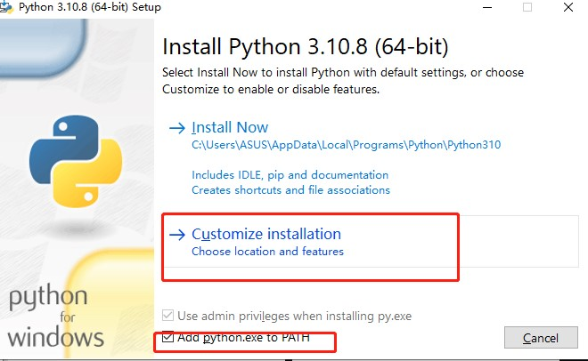

# HSV 工具使用

## 环境安装

Python配置教程：  
打开官网：https://www.python.org/downloads/windows/ 下载中心，下载最新版本  
  
下载完成后，点击.exe文件，勾选Add Python to PATH，然后再点击Customize installation进入到下一步  
  
进入Optional Features后，不用操作，直接点击Next  
   
点击Browse进行自定义安装路径，也可以直接点击install安装  


打开文件夹，在文件夹空白 按住 `shift` 并点击右键

选择`在此处打开 Powershell 窗口`

通过 pip 安装包环境

清华下载源加速

```shell
pip config set global.index-url https://mirrors.aliyun.com/pypi/simple
```

安装运行环境（opencv和numpy）

```shell
pip install -r requirements.txt
```

## 工具使用

### 从机器人网页传输图像中获取

这里需要确保初始化launch已启动，可以打开机器人的网页并看到实时图像

如果没有机器人没有启动初始化节点，在终端中输入
```shell
roslaunch aelos_smart_ros start.launch
```

想要从机器人网页图像中进行hsv选取


比如
```shell
python3 hsvSelectTools.py -u http://192.168.1.168:8080/stream_viewer?topic=/usb_cam_chest/image_raw
```

### 打开本地图片

想要打开某个图片可以使用
```shell
python3 hsvSelectTools.py -i img/hsvURL.jpg
```

### 选择目标颜色

左键图片上的目标选择颜色, 右键清除鼠标选择范围。

这时图片左上角会显示 HSV 范围，这是下面滑条的参考范围。多次点击可以提供更完成的范围作为参考

### 滑动条

工具目的是选择识别目标的HSV色彩范围，以及可视化 溶蚀量(erode) 和 膨胀量(dilate)

请从上而下调节滑动条，已确保获得目标色彩范围。

#### 调整 HSV 滑动条

LowerH 是 H（色调）范围的下限，LowerH 是 H（色调）范围的上限。

同理 S 滑动条选择  饱和度，V 滑动条选择 明度。

滑动时请确保下限值不要大于上限值，否则窗口将不会选中任何像素。

#### 调整 溶蚀和膨胀条

这两个参数，不理解可以不改动。

溶蚀量(erode) 和 膨胀量(dilate) 滑条是程序中，目标过滤的两个参数。

erode 是为了过滤除了目标以外的多余像素，方便程序识别最大面积的目标色块作为识别目标。

dilate 是为了补充目标色块因为 erode 操作而损失的边缘。

### 输出结果

在窗口按q，会将结果打印在控制台。将这个色彩范围复制到识别程序中即可
