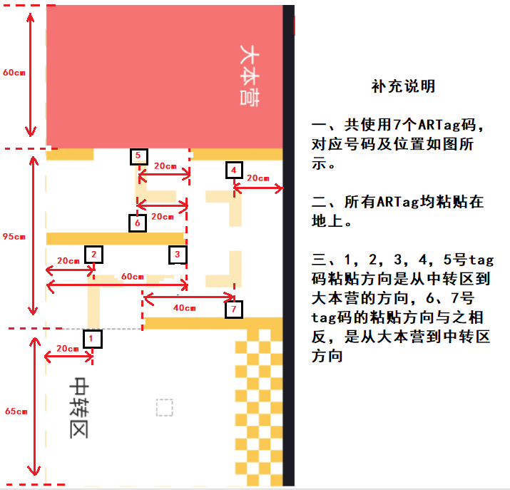
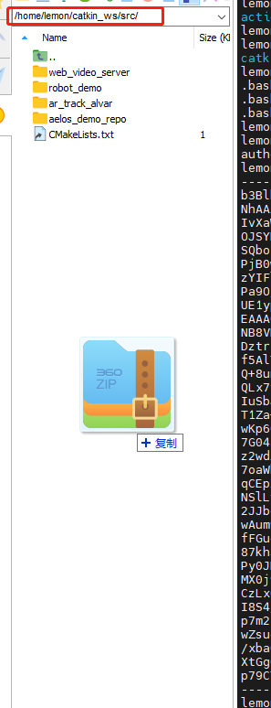
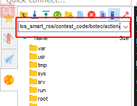
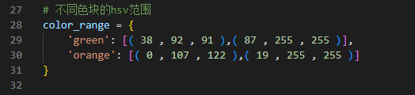

# botec比赛程序运行步骤  

### Tag粘贴图示：  
  

## 一、程序下载：
```
在 Mobaxterm 中进入此路径：/home/lemon/catkin_ws/src  
并将 botec.zip 压缩包解压并拉进此路径中  
```


## 二、动作工程下载  

使用Mobaxterm进行ssh连接后，在下图位置输入此路径回车,可以看到 人工智能大赛-自动.rar,并右击下载到电脑上并解压    
  
```
/home/lemon/catkin_ws/src/botec  
```
通过 aelos_edu 连接串口，点击动作下载，并复位机器人  


## 三、HSV颜色采集  
HSV采集工具在  
```
/home/lemon/catkin_ws/src/botec  
```
根据里面的 HSV颜色工具 文档进行python的安装及采集  

### <font color='red'> **注意：当环境发生变化时，请重新采集 HSV 数值** </font>

## 四、程序调试  
botec程序位于  
```
/home/lemon/catkin_ws/src/botec/scripts/botec_code.py  
```

我们需要将采集到的 HSV 数值替换到，botec_code.py 中第 29，30行  
  

程序运行指令：  
```
cd /home/lemon/catkin_ws/src/botec/scripts/
python botec_code.py  
```