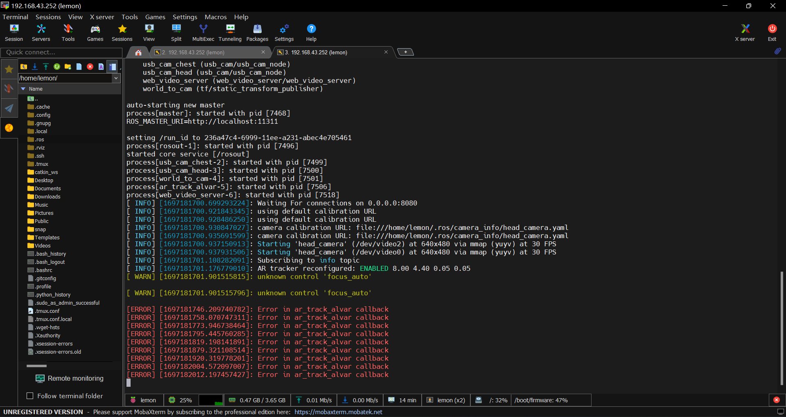
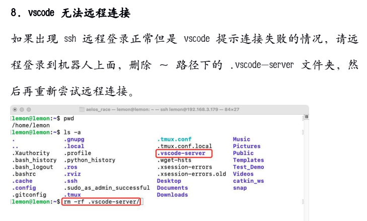

# Aelos
---

#### \- 调试前准备工作 -
- 最好先检查下各个aelos上是否都装有查看cpu主板温度的sensors插件，若没有最好先安装上，在后续调试过程中随时查看主板温度防止其过热烧起来冒烟然后寄掉
`$ sensors   //检查是否安装了sensors，若未安装则跟弹出的提示安装即可`

#### 启动Aelos主程序的指令
<!-- ```shell -->
##### 人工智能赛时期运行Aelos主程序的指令:
aelos-smart
```shell
$ cd /home/lemon/catkin_ws/src/college_caai/launch
$ roslaunch AI_competition.launch
$ cd /home/lemon/catkin_ws/src/robot_demo/scripts
$ python college_tag_traker_fast_right.py
``` 

aelos-pro
```shell
$ roslaunch robot_demo ar_track.launch
$ cd /home/lemon/catkin_ws/src/robot_demo/scripts
$ python  college_tag_traker_fast_right.py
```


##### 仿人竞速适用指令:
aelos-pro-7013
```shell
若需要先打开节点则输入
$ cd /home/lemon/catkin_ws/src/robot_demo/launch
$ roslaunch ar_tracker.launch

或者也可以用下面的指令来开启aelos总节点
$ roslaunch robot_demo ar_track.launch
$ cd /home/lemon/catkin_ws/src/robot_demo/scripts
$ python follow_lines.py
```

aelos-pro-700C
```shell
若需要先打开节点则输入
$ cd /home/lemon/catkin_ws/src/aelos_race_demo/robot_demo/launch
$ roslaunch ar_tracker.launch

或者也可以用下面的指令来开启aelos总节点，广泛使用
$ roslaunch robot_demo ar_track.launch
$ cd /home/lemon/catkin_ws/src/robot_demo/scripts
$ python follow_lines.py
```

aelos_pro-7011
```shell
遗留着人工智能赛时期的代码
$ cd /home/lemon/catkin_ws/src/robot_demo/scripts
$ python follow_lines.py
```

#### 各机型连接手机热点后的ip地址
+ 700C : 192.168.43.218
+ 7013 : 192.168.43.252 -> 格式化tf卡时错误，后又重新烧录成功但和原来没变化，应该时没重新烧录成功
+ 7011 : 192.168.43.19 
+ 还有一台Aelos都不能进行手机热点连接，应该是手动版的 -> 更新：有一台smart版aelos，用的是smart镜像，但因客服失误错误烧进去了高校版镜像导致tf卡丢失，目前

#### 仿人竞速备赛阶段问题总结
##### 1. Aelos与电脑的远程连接(ssh)
+ 用vscode
##### 2. Aelos内部自带摄像头的调用
##### 3. 循线代码编写
##### 4. Aelos自带动作函数的调用

---

### 调试阶段
#### 任务列表
##### 1. 将可以进行基本动作运行的(能跑起来的)aelos的配置复制到另外两台有问题的aelos上，实现三台aelos轮换使用，两台参赛一台正赛备用
- 让7013动起来的奋斗过程： 

图片中的[ERROR]是在打开aelos总节点 -> `$ roslaunch robot_demo ar_tracker.launch`后自动打印出的，且周期性打印
在vscode中全局搜素`callback`找到该路径下的日志文件`/home/lemon/.ros/log/057ed14c-aedb-11eb-b203-6960de636240/rosout.log`，可以在该文件中找到打印[ERROR]信息的对应文件`/home/lemon/catkin_ws/src/ar_track_alvar/ar_track_alvar/nodes/IndividualMarkersNoKinect.cpp`
##### 2. 自定义aelos单步前进动作，调aelos零点，保证走全程的稳定性
##### 3. 改巡线代码
##### 4. 技术报告

---

### 问题讨论
- ##### aelos可以连接MobaXterm但是连不上vscode
  先用MobaXterm连接aelos按下图操作
  
  在vscode中用ssh连接时选择`连接到主机...`，然后点`+添加新的SSH主机...`，按照`ssh <名称>@<ip地址>`的格式输入命令添加ssh主机后，再去进行ssh连接即可
  > 注意aelos连接后用`linux`系统打开，因其内部为linux系统